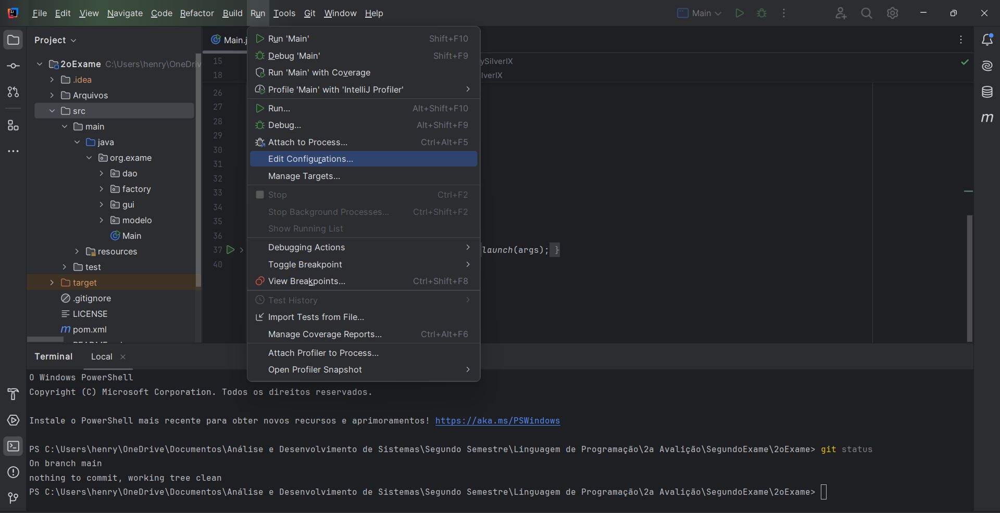

# Cadastro de Aluno
Cadastro de alunos (CRUD) usando Java

# Configurações para esse projeto

Aqui estão algumas configurações necessárias para esse projeto:

## Configuração para o JavaFX
Para configurar o JavaFX, primeiro devemos baixá-lo. Para esse projeto, eu usei o JavaFX SDK 22. É possível fazer o
download nesse site:  
https://jdk.java.net/javafx23/  

Após baixar o arquivo .zip, coloque a pasta em qualquer lugar que desejar em seu computador.
No IntelliJ IDEA, siga o seguinte caminho:  
Run → Edit Configurations...  
Veja abaixo:
 
Uma nova janela irá se abrir. Nessa janela, clique no símbolo de mais para adicionar uma nova configuração. Nessa
opção, seleciona a primeira (Application).
Nessa nova opção, dê um nome para essa nova configuração. Depois disso clique na opção:
**Modify options** e clique em **Add VM options.** Um novo campo irá aparecer chamado *VM Options.* Nesse campo,
coloque a seguinte configuração:  
**--module-path "caminho do javaFX no seu computador" --add-modules javafx.controls,javafx.fxml**  
Após isso, é só clicar em **Apply** e sair dessa janela.  

## Configuração para o MySQL Connector/J 9.1.0

É possível que você passe por esse problema indicado no terminal:

*Exception in thread "main" java.lang.RuntimeException: java.sql.SQLException: No suitable driver found for jdbc:mysql://localhost/secondExam*  

Para resolver esse erro, é necessário configurar o MySQL Connector 9.1.0. Para fazer isso, primeiramente devemos
fazer o download do MySQL Connector. Utilize o seguinte link: <a href="https://dev.mysql.com/downloads/connector/j/">MYSQL Connector</a>.
Nesse site, selecione Platform Independent, e após isso, selecione Platform Independent (Architecture Independent), ZIP Archive e clique em download.
Após o download, descompacte o arquivo zip e coloque a pasta em algum lugar do seu computador.
A partir disso, navegue até encontrar o arquivo mysql-connector-j-9.1.0.jar.
No IntelliJ, selecione File → Project Structure → Libraries. Clique no símbolo de + e adicione o caminho até o mysql-connector-j-9.1.0.jar.